# Linear Regression

- State the basic idea of learning a function from data to help use predict values we dont have data for
- Give a few examples
- Linear regression is the most basic learning task
- Fitting a straight line ($y = wx + b$, we are intetionally using $w$ ineaste of the more traditional $m$ to better align with future lesons) to data
- learning two parmaters, the slope $w$  and $y$-intercets $b$
- The process is start with a random asignment of values to the parameters
measure how well that line and those paramters fit the data then update the
paramters to improve the fit.

## Training

Training starts with a guess for the model parameters. We measure how well the
guess fits the data, adjust the parameters to improve it, and repeat. We stop
when the improvements level out and each new round barely changes the loss.
Ideally that is also the point where the model fits well. It doesn't have to
be. A model can stop improving because it has found the best answer it can
reach, even if that answer is still poor.

### Data

We start with synthetic data, where we choose the line ahead of time.  Because
we know what $w$ and $b$ should be, we can check whether training finds them.
Each dataset has 50 points where noise is random scatter added to each $y$
value. With no noise, every point falls exactly on the line. With
more noise, the line gets harder to see.

| Generating function | Noise (sd) | Plot |
|-|-|-|
| $y=0.5x+3$ | 0   | 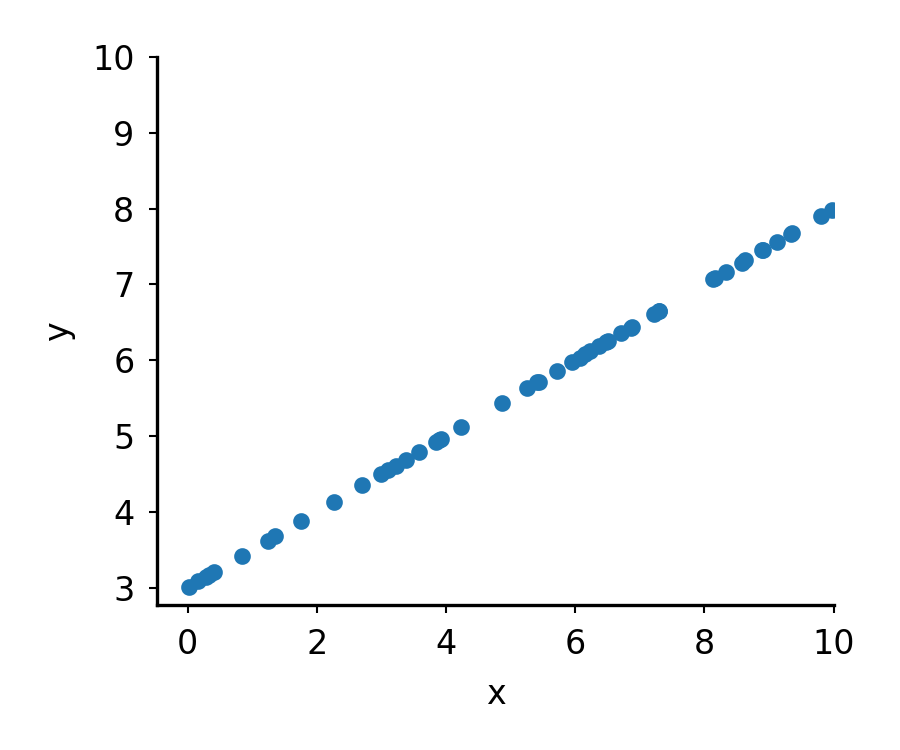 |
| $y=2x+1$   | 0   | 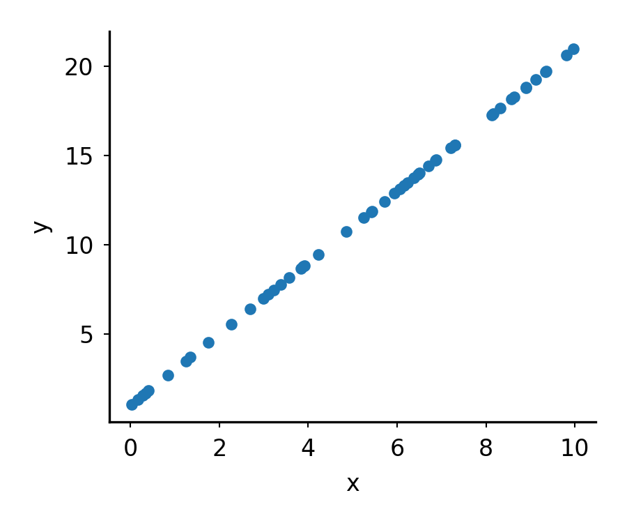   |
| $y=2x+1$   | 1.5 | 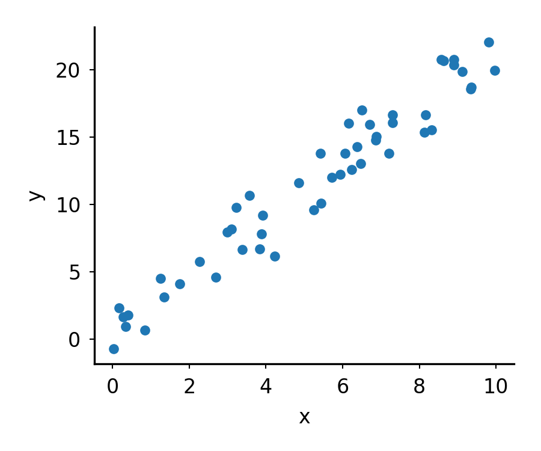  |
| $y=2x+1$   | 5   | 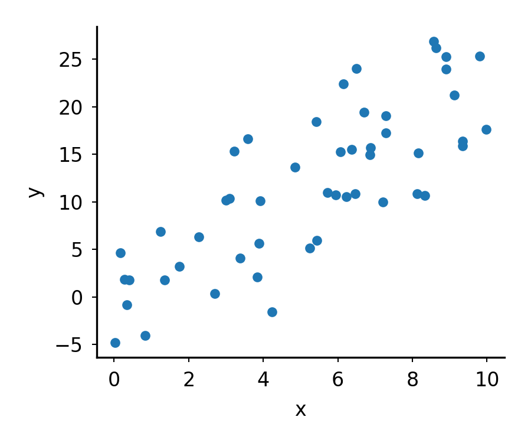    |

<details>

```
python src/make_line_dataset.py \
    --w 0.5 \
    --b 3 \
    --noise 0 \
    --out out/line_0.5x_3_no_noise.tsv

tail -n +2 out/line_0.5x_3_no_noise.tsv \
| python src/plot_line.py \
    -o img/line_0.5x_3_no_noise.png \
    -x x \
    -y y \
    --point_size 3 \
    --markeredgecolor tab:blue \
    --markerfacecolor tab:blue \
    --width 3 \
    --height 2.5 \
    --line_style o 

python src/make_line_dataset.py \
    --w 2 \
    --b 1 \
    --noise 0 \
    --out out/line_2x_1_no_noise.tsv

tail -n +2 out/line_2x_1_no_noise.tsv \
| python src/plot_line.py \
    -o img/line_2x_1_no_noise.png \
    -x x \
    -y y \
    --point_size 3 \
    --markeredgecolor tab:blue \
    --markerfacecolor tab:blue \
    --width 3 \
    --height 2.5 \
    --line_style o 

python src/make_line_dataset.py \
    --w 2 \
    --b 1 \
    --noise 1.5 \
    --out out/line_2x_1_1.5_noise.tsv

tail -n +2 out/line_2x_1_1.5_noise.tsv \
| python src/plot_line.py \
    -o img/line_2x_1_1.5_noise.png \
    -x x \
    -y y \
    --point_size 3 \
    --markeredgecolor tab:blue \
    --markerfacecolor tab:blue \
    --width 3 \
    --height 2.5 \
    --line_style o

python src/make_line_dataset.py \
    --w 2 \
    --b 1 \
    --noise 5 \
    --out out/line_2x_1_5_noise.tsv

tail -n +2 out/line_2x_1_5_noise.tsv \
| python src/plot_line.py \
    -o img/line_2x_1_5_noise.png \
    -x x \
    -y y \
    --point_size 3 \
    --markeredgecolor tab:blue \
    --markerfacecolor tab:blue \
    --width 3 \
    --height 2.5 \
    --line_style o

```

</details>

## Loss

To judge how well a line fits the data, we measure the distance from each point
to the line and combine those distances into one number. The distance we use is
vertical, the gap between the observed $y$ and the line's prediction $\hat{y} =
wx + b$. That gap is called the residual. Squaring each residual and taking the
mean gives the mean squared error (MSE).

$$\text{MSE} = \frac{1}{n}\sum_{i=1}^{n}(\hat{y}_i - y_i)^2$$

A function that scores a model's predictions like this is called a loss
function. A lower loss means a better fit, and a perfect line has a loss of 0.

Suppose we pick the line $y=05.x+8$, then the loss for the different data sets would be

| MSE | Plot|
|-|-|
| 25.0    | 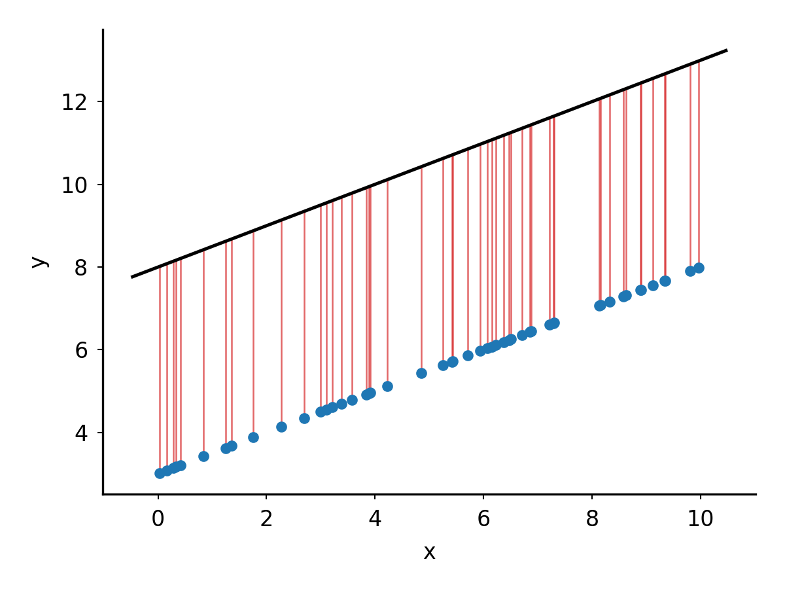 |
| 19.9273 | 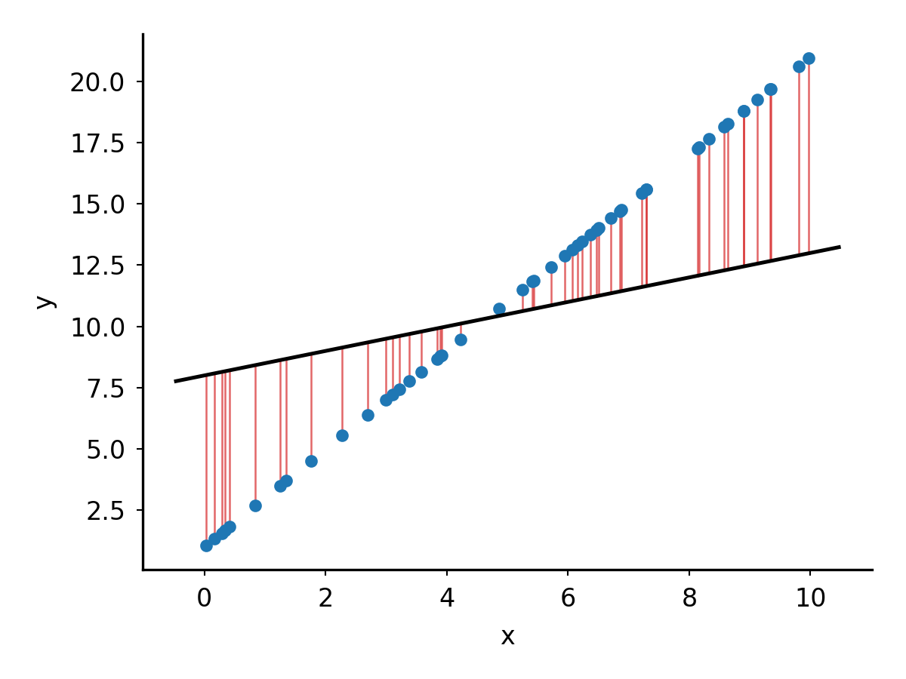 | 
| 24.3077 | 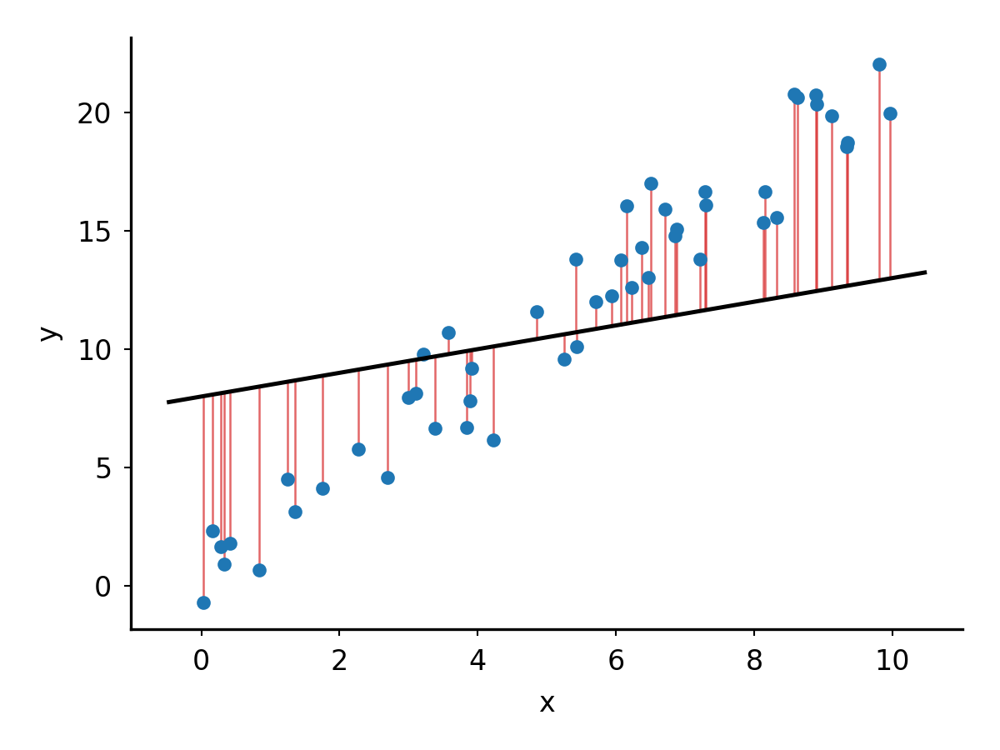 |
| 52.3390 | 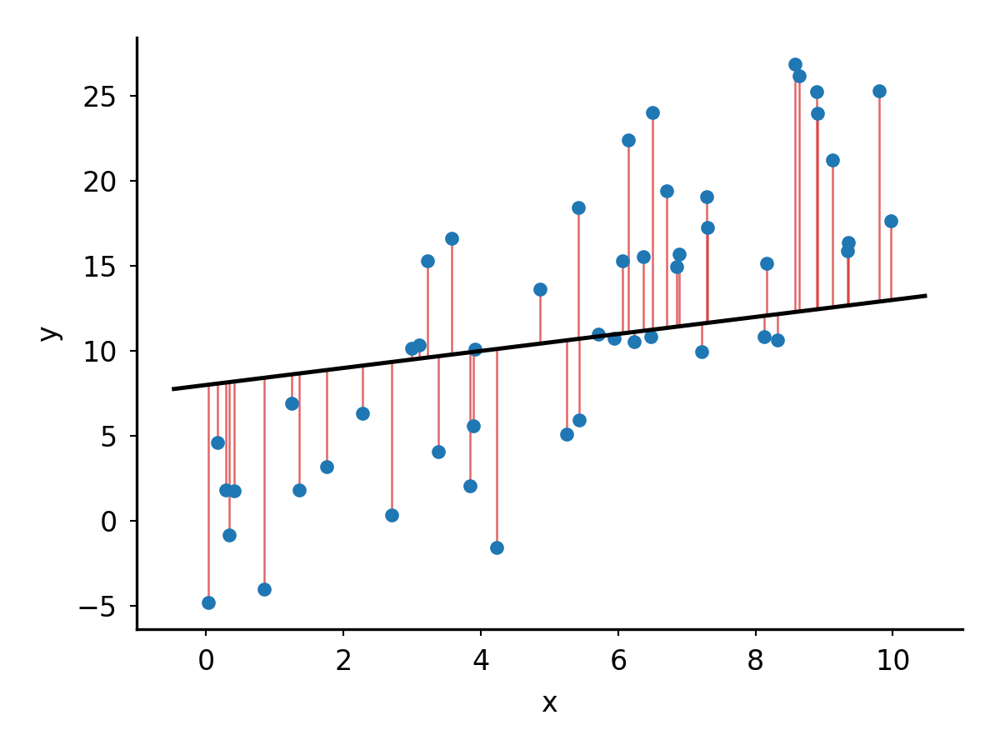 |

<details>

```
for data in out/line_0.5x_3_no_noise.tsv out/line_2x_1_1.5_noise.tsv out/line_2x_1_5_noise.tsv out/line_2x_1_no_noise.tsv; do
    echo $data

    python src/line_loss.py \
        --data $data \
        --w 0.5 \
        --b 8

    base=$(basename $data .tsv)

    python src/plot_fit.py \
        --data $data \
        --w 0.5 \
        --b 8 \
        --residuals \
        -o img/${base}.residuals.png \
        -x x \
        -y y 
done

out/line_0.5x_3_no_noise.tsv
mse=25.0000
out/line_2x_1_1.5_noise.tsv
mse=24.3077
out/line_2x_1_5_noise.tsv
mse=52.3390
out/line_2x_1_no_noise.tsv
mse=19.9273
```

</details>


## Updating paramters

To improve the line we need to know which direction to move $w$ and $b$. We
could do this by nudging each parameter up and down by a small amount and see
what happens to the loss.

| change | w | b | MSE | vs. start |
|-|-|-|-|-|
| none    | 0.500 | 8.000 | 24.3077 | 0 |
| w + 0.1 | 0.600 | 8.000 | 20.9850 | -3.3227 |
| w - 0.1 | 0.400 | 8.000 | 28.3553 | +4.0476 |
| b + 0.1 | 0.500 | 8.100 | 24.1272 | -0.1805 |
| b - 0.1 | 0.500 | 7.900 | 24.5081 | +0.2004 |

Increasing $w$ lowers the loss the most, and increasing $b$ lowers less.  In
the next step we should increase both should go up, ith $w$ mattering the most.

<details>

```
data=out/line_2x_1_1.5_noise.tsv
python src/line_loss.py \
    --data $data \
    --w 0.5 \
    --b 8
mse=24.3077

python src/line_loss.py \
    --data $data \
    --w 0.6 \
    --b 8
mse=20.9850

echo "20.9850-24.3077" | bc
-3.3227

python src/line_loss.py \
    --data $data \
    --w 0.4 \
    --b 8
mse=28.3553

echo "28.3553-24.3077" | bc
4.0476

python src/line_loss.py \
    --data $data \
    --w 0.5 \
    --b 8.1
mse=24.1272

echo "24.1272-24.3077" | bc
-.1805

python src/line_loss.py \
    --data $data \
    --w 0.5 \
    --b 7.9 
mse=24.5081

echo "24.5081-24.3077" | bc
.2004

```

</details>

The derivative of the Loss gives us the same result without all of the trials.

$$\frac{\partial L}{\partial w} = \frac{1}{n}\sum 2(\hat{y}_i - y_i)\,x_i \qquad \frac{\partial L}{\partial b} = \frac{1}{n}\sum 2(\hat{y}_i - y_i)$$

<details>

Our Loss fucntion is MSE, which  averages the squared residual over all $n$ points.

$$\text{MSE} = \frac{1}{n}\sum_{i=1}^{n}(\hat{y}_i - y_i)^2$$

The prediction $\hat{y}_i$ is just the line evaluated at $x_i$, so we can
replace it with $wx_i + b$.

$$\text{MSE} = \frac{1}{n}\sum_{i=1}^{n}(wx_i + b - y_i)^2$$

Each term in that sum is the loss for one point. Call it $L_i$.

$$L_i = (wx_i + b - y_i)^2 \qquad \text{so} \qquad \text{MSE} = \frac{1}{n}\sum_{i=1}^{n} L_i$$

The derivative of a sum is the sum of the derivatives, and the constant
$\frac{1}{n}$ just comes along. So we can work out the derivative for one point
and then average.

$$\frac{\partial\,\text{MSE}}{\partial w} = \frac{1}{n}\sum_{i=1}^{n}\frac{\partial L_i}{\partial w} \qquad \frac{\partial\,\text{MSE}}{\partial b} = \frac{1}{n}\sum_{i=1}^{n}\frac{\partial L_i}{\partial b}$$

For a single point, the chain rule gives

$$\frac{\partial L_i}{\partial w} = 2(wx_i + b - y_i)\,x_i \qquad \frac{\partial L_i}{\partial b} = 2(wx_i + b - y_i)$$

and averaging over the points gives the gradient.

$$\frac{\partial\,\text{MSE}}{\partial w} = \frac{1}{n}\sum_{i=1}^{n}2(wx_i + b - y_i)\,x_i \qquad \frac{\partial\,\text{MSE}}{\partial b} = \frac{1}{n}\sum_{i=1}^{n}2(wx_i + b - y_i)$$

</details>

Together these two numbers are the gradient. By plugging all of the data points
we get $-36.85$ and $-1.90$. A negative value means increasing that parameter
lowers the loss, which matches the table. 

<details>

- The prediction, $\hat{y}_i = 0.5x_i + 8$.
- The residual, $\hat{y}_i - y_i$.
- That point's term for $w$, $2(\hat{y}_i - y_i)\,x_i$.
- That point's term for $b$, $2(\hat{y}_i - y_i)$.

Average each set of terms over the 50 points.

| $i$ | $x_i$ | $y_i$ | $\hat{y}_i$ | residual | $2(\hat{y}_i - y_i)x_i$ | $2(\hat{y}_i - y_i)$
|-|-|-|-|-|-|-|
| 1 | 6.37 | 14.28 | 11.18 | -3.09 | -39.37 | -6.18 |
| 2 | 2.70 | 4.58  | 9.35  | 4.77  | 25.71  | 9.53  |
| 3 | 0.41 | 1.81  | 8.20  | 6.39  | 5.24   | 12.78 |
| 4 | 0.17 | 2.32  | 8.08  | 5.77  | 1.91   | 11.53 |
| 5 | 8.13 | 15.33 | 12.07 | -3.27 | -53.13 | -6.53 |
|...| | | | | | |
|mean| | | | | -36.85 | -1.90 |

```
python src/line_gradient.py \
    --data out/line_2x_1_1.5_noise.tsv \
    --w 0.5 \
    --b 8 \
    --points 5
  i       x       y   y_hat   resid   w term   b term
  1    6.37   14.28   11.18   -3.09   -39.37    -6.18
  2    2.70    4.58    9.35    4.77    25.71     9.53
  3    0.41    1.81    8.20    6.39     5.24    12.78
  4    0.17    2.32    8.08    5.77     1.91    11.53
  5    8.13   15.33   12.07   -3.27   -53.13    -6.53
sum                                 -1842.59   -95.23
n=50
dL/dw=-36.8518 dL/db=-1.9047
```

</details>

### Gradient descent

Gradient descent repeats these steps many times.
1. Predict $\hat{y}$ for every $x$ with the current $w$ and $b$.
2. Compute the loss.
3. Compute the gradient.
4. Move each parameter a small step against its gradient.
$$w \leftarrow w - \eta \frac{\partial L}{\partial w} \qquad b \leftarrow b - \eta \frac{\partial L}{\partial b}$$

The step size $\eta$ is the learning rate. Each pass through the data is one
epoch. Here we use a learning rate of 0.02 and train for 500 epochs.

Starting from $w = 0.5$ and $b = 8$, the first epoch moves the parameters to

$$w = 0.5 - (0.02 \times -36.8518) = 1.237 \qquad b = 8 - (0.02 \times -1.9047) = 8.038$$

Both gradients are negative, so both parameters go up. $w$ moves about 20 times
as far as $b$ because its gradient is about 20 times larger.


## Training


| Noise | Loss | w,b |
|-|-|-|
| 1.5 | 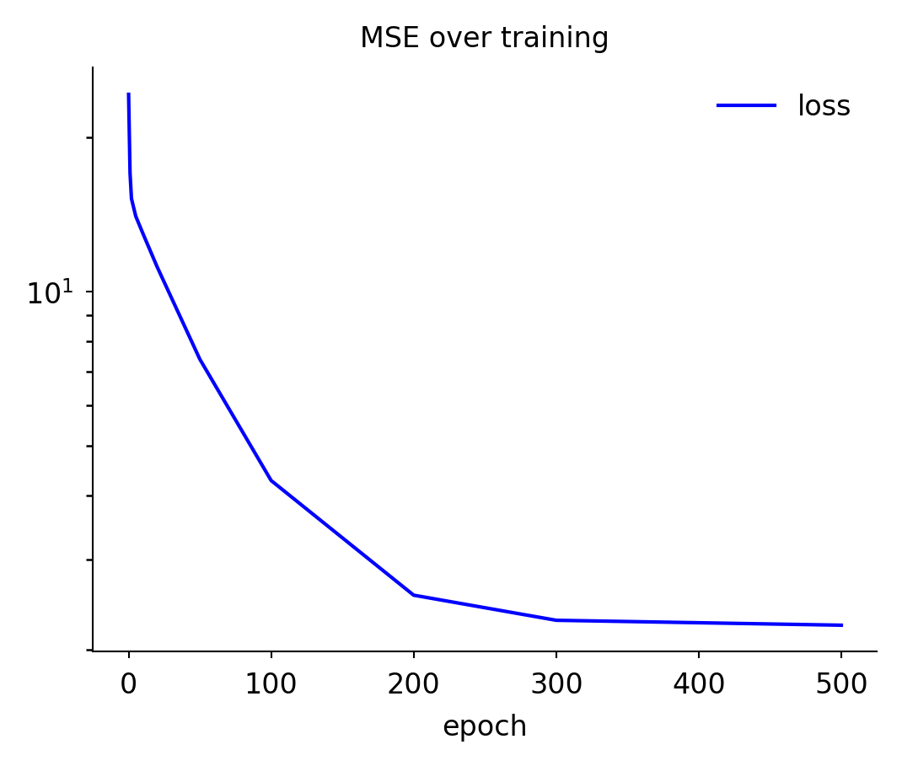 | 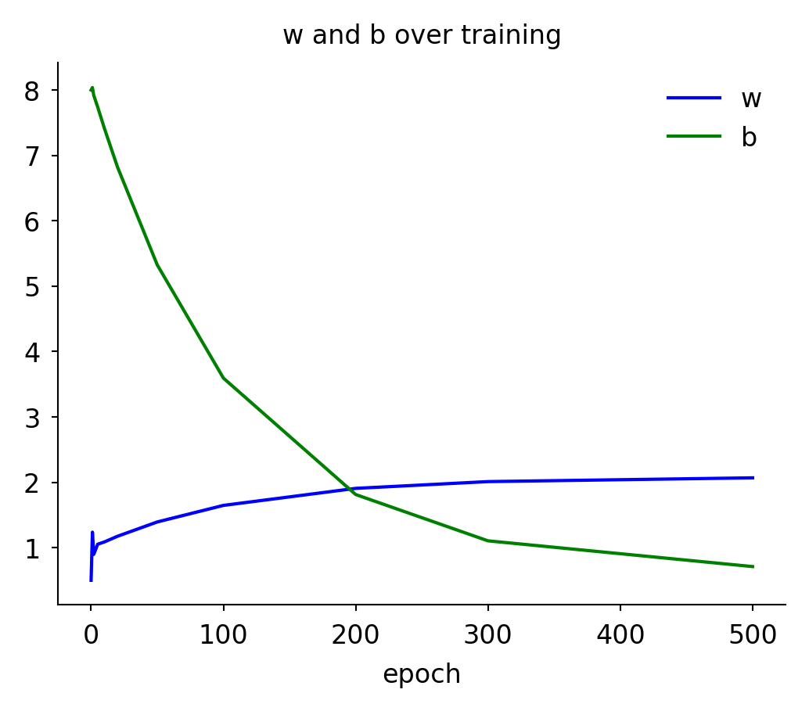 |
| 5 | 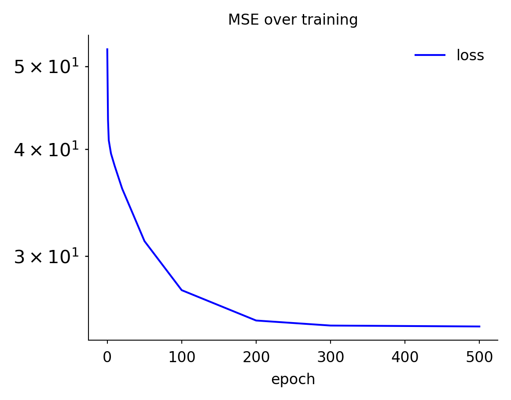 | 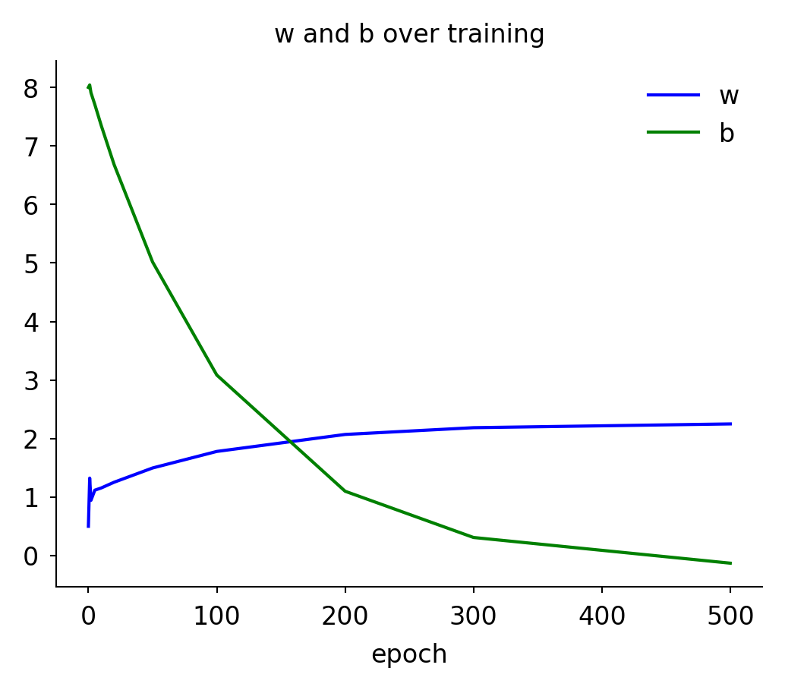 |


```
python src/train_line.py \
    --data out/line_2x_1_1.5_noise.tsv \
    --w0 0.5 \
    --b0 8 \
    --lr 0.02 \
    --epochs 500 \
    --out_prefix out/line_2x_1_1.5_noise
epoch 0000 mse=24.3077 w=+0.500 b=+8.000 dL/dw=-36.852 dL/db=-1.905
epoch 0001 mse=17.0632 w=+1.237 b=+8.038 dL/dw=+16.985 dL/db=+5.937
epoch 0002 mse=15.2106 w=+0.897 b=+7.919 dL/dw=-8.894 dL/db=+2.121
epoch 0005 mse=14.0573 w=+1.053 b=+7.739 dL/dw=+0.458 dL/db=+3.395
epoch 0010 mse=13.0105 w=+1.086 b=+7.417 dL/dw=-0.479 dL/db=+3.108
epoch 0020 mse=11.1958 w=+1.174 b=+6.820 dL/dw=-0.415 dL/db=+2.838
epoch 0050 mse=7.3883 w=+1.393 b=+5.325 dL/dw=-0.315 dL/db=+2.152
epoch 0100 mse=4.2845 w=+1.646 b=+3.593 dL/dw=-0.198 dL/db=+1.357
epoch 0200 mse=2.5592 w=+1.906 b=+1.812 dL/dw=-0.079 dL/db=+0.540
epoch 0300 mse=2.2864 w=+2.010 b=+1.104 dL/dw=-0.031 dL/db=+0.215
epoch 0500 mse=2.2364 w=+2.068 b=+0.710 dL/dw=-0.005 dL/db=+0.034
wrote out/line_2x_1_1.5_noise.params.tsv

python src/plot_training.py \
    -i out/line_2x_1_1.5_noise.params.tsv \
    -o img/line_2x_1_1.5_noise.params.training.png \
    --columns loss \
    --ylog \
    --title "MSE over training"

python src/plot_training.py \
    -i out/line_2x_1_1.5_noise.params.tsv \
    -o img/line_2x_1_1.5_noise.params.png \
    --columns w,b \
    --title "w and b over training"

python src/train_line.py \
    --data out/line_2x_1_5_noise.tsv \
    --w0 0.5 \
    --b0 8 \
    --lr 0.02 \
    --epochs 500 \
    --out_prefix out/line_2x_1_5_noise
epoch 0000 mse=52.3390 w=+0.500 b=+8.000 dL/dw=-41.188 dL/db=-2.137
epoch 0001 mse=43.2901 w=+1.324 b=+8.043 dL/dw=+18.985 dL/db=+6.628
epoch 0002 mse=40.9770 w=+0.944 b=+7.910 dL/dw=-9.940 dL/db=+2.362
epoch 0005 mse=39.5398 w=+1.118 b=+7.709 dL/dw=+0.513 dL/db=+3.787
epoch 0010 mse=38.2377 w=+1.155 b=+7.350 dL/dw=-0.534 dL/db=+3.467
epoch 0020 mse=35.9805 w=+1.253 b=+6.684 dL/dw=-0.463 dL/db=+3.165
epoch 0050 mse=31.2443 w=+1.497 b=+5.017 dL/dw=-0.351 dL/db=+2.400
epoch 0100 mse=27.3836 w=+1.779 b=+3.085 dL/dw=-0.221 dL/db=+1.514
epoch 0200 mse=25.2375 w=+2.070 b=+1.099 dL/dw=-0.088 dL/db=+0.602
epoch 0300 mse=24.8981 w=+2.185 b=+0.309 dL/dw=-0.035 dL/db=+0.239
epoch 0500 mse=24.8359 w=+2.250 b=-0.130 dL/dw=-0.006 dL/db=+0.038

python src/plot_training.py \
    -i out/line_2x_1_5_noise.params.tsv \
    -o img/line_2x_1_5_noise.params.training.png \
    --columns loss \
    --ylog \
    --title "MSE over training"

python src/plot_training.py \
    -i out/line_2x_1_5_noise.params.tsv \
    -o img/line_2x_1_5_noise.params.png \
    --columns w,b \
    --title "w and b over training"
```
