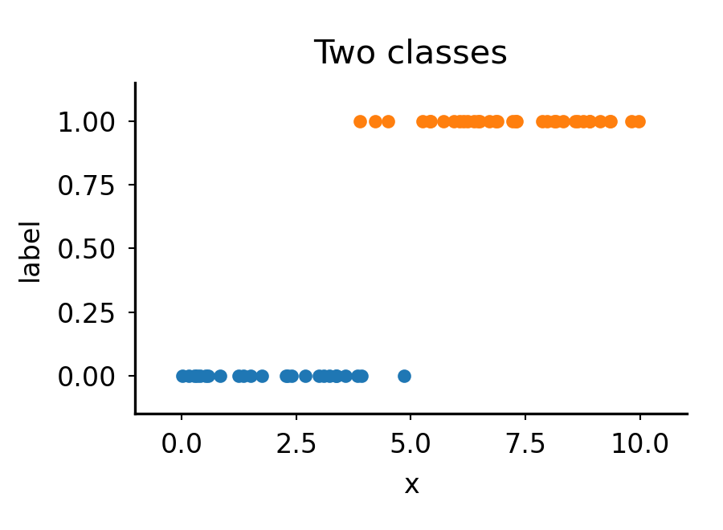
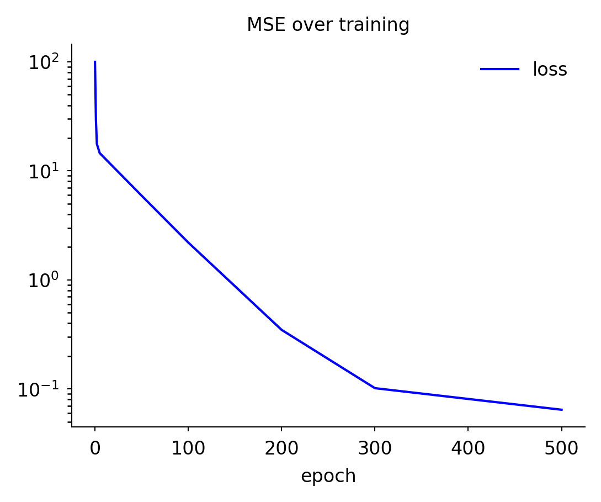
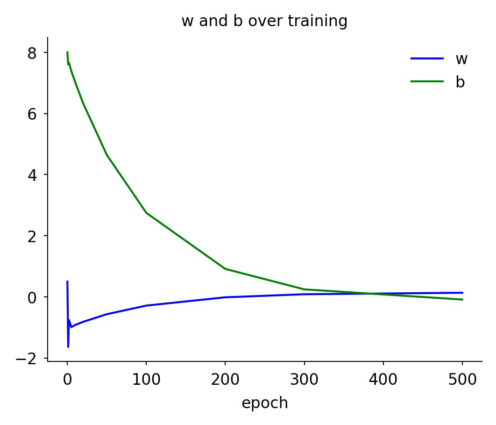
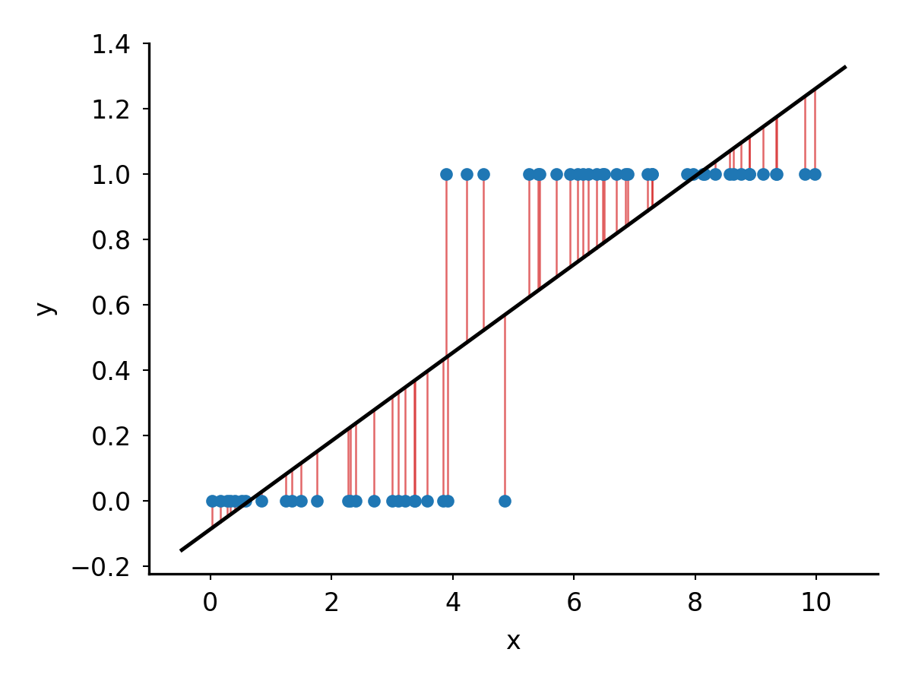
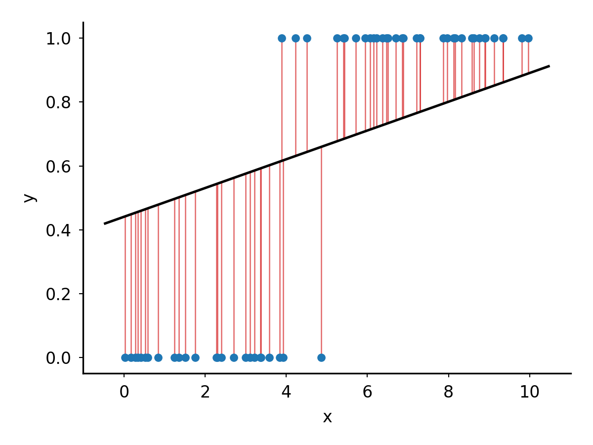
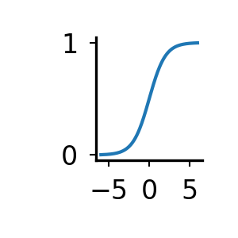

# Classification

## Learning goals

After this module you should be able to

1. Explain the difference between regression and classification.
2. Explain why a linear model with mean squared error is not a good classifier.
3. Describe how logistic regression uses a sigmoid to predict probabilities.
4. Explain binary cross-entropy and why it is useful for classification.
5. Describe how gradient descent trains a classification model.

## Introduction


Machine learning uses examples to make predictions about things we have not
observed. In linear regression, we predict a number, like how square footage
predicts price. In classification, we want to predict which category an example
belongs to, like whether an email is spam or whether a patient will develop a
disease.  

But we already know how to fit a line to data. Can we use the same approach to
classify things?

## Data

We start with a small synthetic dataset containing 60 observations and one
feature, $x$.  Observations with smaller values of $x$ are mostly class 0.
Observations with larger values are mostly class 1. There is some overlap
between the classes.



<details>

```
python src/make_class_dataset.py \
    --out out/class.data.tsv

python src/plot_fit.py \
    --data out/class.data.tsv \
    --w 0 \
    --b -100 \
    --color_by_label \
    -o img/class.data.png \
    -x x \
    -y label \
    --width 3 \
    --height 2.2 \
    --y_min -0.15 \
    --y_max 1.15 \
    --title "Two classes;10;center"
```

</details>


## Linear regression as a classifier

We can fit a line to these data just like we did for linear regression. The
difference is that now the observed values are either 0 or 1.

To turn the fitted line into a classifier, we need a rule that maps its output
to a class. Here we use 0.5 as the decision boundary: if $\hat{y} < 0.5$, we
predict class 0; otherwise, we predict class 1.

The plots below show the loss decreasing during training, the values of $w$ and
$b$ changing, and the final fitted line. At the end of training, the model has
learned $w=0.135$ and $b=-0.087$.

|Loss | $w,b$ | Fit |
|-|-|-|
|  |  |  |

<details>

```
python src/train_line.py \
    --data out/class.data.tsv \
    --w0 0.5 \
    --b0 8 \
    --lr 0.02 \
    --epochs 500 \
    --out_prefix out/class.data
epoch 0000 mse=100.0553 w=+0.500 b=+8.000 dL/dw=+106.779 dL/db=+19.887
epoch 0001 mse=29.4520 w=-1.636 b=+7.602 dL/dw=-43.897 dL/db=-2.492
epoch 0002 mse=17.6992 w=-0.758 b=+7.652 dL/dw=+16.898 dL/db=+6.481
epoch 0005 mse=14.5802 w=-0.989 b=+7.382 dL/dw=-1.707 dL/db=+3.604
epoch 0010 mse=13.1789 w=-0.917 b=+7.014 dL/dw=-0.520 dL/db=+3.590
epoch 0020 mse=10.7832 w=-0.816 b=+6.328 dL/dw=-0.481 dL/db=+3.244
epoch 0050 mse=5.9165 w=-0.566 b=+4.640 dL/dw=-0.355 dL/db=+2.397
epoch 0100 mse=2.1985 w=-0.285 b=+2.748 dL/dw=-0.215 dL/db=+1.448
epoch 0200 mse=0.3477 w=-0.013 b=+0.914 dL/dw=-0.078 dL/db=+0.528
epoch 0300 mse=0.1015 w=+0.086 b=+0.246 dL/dw=-0.029 dL/db=+0.193
epoch 0500 mse=0.0644 w=+0.135 b=-0.087 dL/dw=-0.004 dL/db=+0.026
wrote out/class.data.params.tsv

python src/plot_training.py \
    -i out/class.data.params.tsv \
    -o img/class.data.params.training.png \
    --columns loss \
    --ylog \
    --title "MSE over training"

python src/plot_training.py \
    -i out/class.data.params.tsv \
    -o img/class.data.params.png \
    --columns w,b \
    --title "w and b over training"
    
python src/plot_fit.py \
    --data  out/class.data.tsv \
    --w 0.135 \
    --b -0.087 \
    --residuals \
    -o img/class.data.tsv.residuals.png \
    -x x \
    -y y


```

</details>


To turn the fitted line into a classifier, we first use inference to calculate
$\hat{y}$ for each observation:

$$
\hat{y} = wx + b
$$

We then need a rule that maps $\hat{y}$ to a class. Here we use 0.5 as the
decision boundary. If $\hat{y} < 0.5$, we predict class 0. Otherwise, we
predict class 1.

We can evaluate these predictions using accuracy, the fraction of observations
assigned to the correct class.

$$
\text{accuracy} =
\frac{\text{number correctly classified}}
{\text{total number of observations}}
$$

Using our trained model, 57 of the 60 observations are classified correctly,
giving an accuracy of 95%. So fitting a line and using 0.5 as a decision
boundary works well for these points.

<details>

```
correct=0
total=0

while read x class; do

    y_hat=$(python src/linear_inference.py \
        --w 0.135 \
        --b -0.087 \
        --x "$x" \
        | tail -n +2 \
        | awk '{print $2}')

    pred=$(awk -v y="$y_hat" 'BEGIN {print (y >= 0.5) ? 1 : 0}')

    if awk -v p="$pred" -v c="$class" 'BEGIN {exit !(p == c)}'; then
        correct=$((correct + 1))
    fi

    total=$((total + 1))

done < <(tail -n +2 out/class.data.tsv)

accuracy=$(awk -v c="$correct" -v t="$total" 'BEGIN {print c/t}')

echo "correct: $correct / $total"
correct: 57 / 60
echo "accuracy: $accuracy"
accuracy: 0.95

```

</details>

## Issues with linear regression as a classifier

Even though we are using the line as a classifier, we are still training it
with MSE. MSE does not have the concept of a decision boundary and does not
track whether a point is on the correct side of it. Instead, it tries to make
every prediction $\hat{y}$ as close as possible to its observed value of 0 or 1.

For example, suppose a class-1 point has $y=1$:
- $\hat{y}=1$ has squared error 0
- $\hat{y}=2$ has squared error 1
- $\hat{y}=10$ has squared error 81

From a classification perspective, all three predictions are comfortably on the
class-1 side of the 0.5 boundary. But MSE thinks predicting 10 is terrible
because it is far from the numerical target of 1.

We can see the effect of this by adding ten more class-1 observations far to the
right, with $x$ between 10 and 20. They are nowhere near the decision boundary
and are easy to classify, but they have a large effect on the fitted line.

| Old fit | New fit |
|-|-|
|  |   |

The resulting line has $w=0.045$ and $b=0.441$, moving the decision boundary
from about $x=4.35$ to about $x=1.31$.

The new observations are easy to classify, but MSE causes them to pull the line
toward $y=1$. The result is a much worse decision boundary for the original
observations.

<details>

```
cp out/class.data.tsv out/class.10_outliers.data.tsv
for v in $(seq 10 20); do 
    echo -e "${v}.0\t1.0" \
    >> out/class.10_outliers.data.tsv
done

python src/plot_fit.py \
    --data out/class.10_outliers.data.tsv \
    --w 0 \
    --b -100 \
    --color_by_label \
    -o img/class.10_outliers.data.png \
    -x x \
    -y label \
    --width 3 \
    --height 2.2 \
    --y_min -0.15 \
    --y_max 1.15 \
    --title "Two classes;10;center"

python src/train_line.py \
    --data out/class.10_outliers.data.tsv \
    --w0 0.5 \
    --b0 8 \
    --lr 0.01 \
    --epochs 500 \
    --out_prefix out/class.10_outliers.data
epoch 0000 mse=117.5150 w=+0.500 b=+8.000 dL/dw=+159.179 dL/db=+21.298
epoch 0001 mse=29.8897 w=-1.092 b=+7.787 dL/dw=-51.917 dL/db=-0.121
epoch 0002 mse=20.5788 w=-0.573 b=+7.788 dL/dw=+16.032 dL/db=+6.729
epoch 0005 mse=18.7730 w=-0.687 b=+7.625 dL/dw=-1.053 dL/db=+4.897
epoch 0010 mse=17.5692 w=-0.658 b=+7.381 dL/dw=-0.483 dL/db=+4.791
epoch 0020 mse=15.3915 w=-0.611 b=+6.916 dL/dw=-0.454 dL/db=+4.482
epoch 0050 mse=10.3568 w=-0.487 b=+5.693 dL/dw=-0.372 dL/db=+3.670
epoch 0100 mse=5.3739 w=-0.328 b=+4.127 dL/dw=-0.266 dL/db=+2.630
epoch 0200 mse=1.4995 w=-0.133 b=+2.201 dL/dw=-0.137 dL/db=+1.351
epoch 0300 mse=0.4772 w=-0.033 b=+1.211 dL/dw=-0.070 dL/db=+0.694
epoch 0500 mse=0.1363 w=+0.045 b=+0.441 dL/dw=-0.019 dL/db=+0.183
wrote out/class.10_outliers.data.params.tsv

python src/plot_training.py \
    -i out/class.10_outliers.data.params.tsv \
    -o img/class.10_outliers.data.params.training.png \
    --columns loss \
    --ylog \
    --title "MSE over training"

python src/plot_training.py \
    -i out/class.10_outliers.data.params.tsv \
    -o img/class.10_outliers.data.params.png \
    --columns w,b \
    --title "w and b over training"

python src/plot_fit.py \
    --data  out/class.data.tsv \
    --w 0.045 \
    --b 0.441 \ 
    --residuals \
    -o img/class.10_outliers.data.tsv.residuals.png \
    -x x \
    -y y

correct=0
total=0

while read x class; do

    y_hat=$(python src/linear_inference.py \
        --w 0.045 \
        --b 0.441 \ 
        --x "$x" \
        | tail -n +2 \
        | awk '{print $2}')

    pred=$(awk -v y="$y_hat" 'BEGIN {print (y >= 0.5) ? 1 : 0}')

    if awk -v p="$pred" -v c="$class" 'BEGIN {exit !(p == c)}'; then
        correct=$((correct + 1))
    fi

    total=$((total + 1))

done < <(tail -n +3 out/class.10_outliers.data.tsv)

accuracy=$(awk -v c="$correct" -v t="$total" 'BEGIN {print c/t}')

echo "correct: $correct / $total"
correct: 54 / 70
echo "accuracy: $accuracy"
accuracy: 0.771429
```

</details>

## Logistic regression

While linear regression does not work well for classification, we can still
build a capable classifier from the core linear framework by changing how we
interpret the model's output and the loss we use to train. Instead of treating
$wx + b$ directly as a prediction for $y$, logistic regression transforms the
output into the probability that an observation belongs to class 1. We also
replace MSE with a loss function designed for classification, where correct,
confident predictions have low loss and confident mistakes have high loss.

The output of $wx+b$ can be any number, but a probability must be between zero
and one. Logistic regression passes $wx+b$ through the sigmoid function, which
maps any value to a value between 0 and 1. Large negative values approach 0,
large positive values approach 1, and $wx+b=0$ maps to 0.5.

|-|-|
| $\hat{p} = \frac{1}{1 + e^{-(wx+b)}}$ |  |

We interpret $\hat{p}$ as the probability that an observation is in class 1.
With the decision boundary set to 0.5, probabilities below 0.5 are classified
as 0 and probabilities at or above 0.5 are classified as 1.

<details>

```bash
python3 -c "
    import numpy as np
    x = np.linspace(-6, 6, 200)
    y = 1/(1+np.exp(-x))
    for xi, yi in zip(x, y): print(xi, yi)
" \
| python3 src/plot_line.py \
    -o img/sigmoid.png \
    --width 1 \
    --height 1 \
    --line_style "-"
```

</details>

